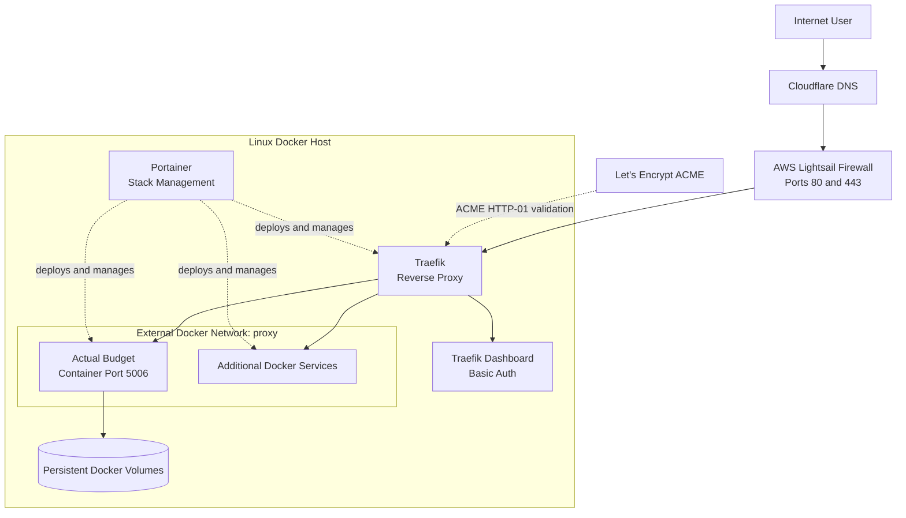

# Self-Hosted Infrastructure

A Docker-based environment for deploying and operating self-hosted applications behind a shared reverse proxy.

This repository is the architecture and documentation hub for the project. The deployable configurations are maintained in separate component repositories so each service can be versioned, updated, and documented independently.

## Overview

The environment uses Docker Compose and Portainer to manage application stacks. Traefik provides centralized routing and HTTPS for services attached to a shared external Docker network. Cloudflare manages public DNS, while application data is kept outside the containers in persistent Docker volumes.

The project is intended to demonstrate practical infrastructure skills including:

- Containerized application deployment
- Reverse proxy routing
- DNS and HTTPS configuration
- Docker networking
- Persistent application storage
- Configuration and secret separation
- Basic authentication, rate limiting, and health checks
- Repeatable service deployment with Docker Compose

## Architecture

## Request Flow

1. A user requests an application through its domain or subdomain.
2. Cloudflare DNS resolves the hostname to the server.
3. The host firewall allows inbound web traffic on ports `80` and `443`.
4. Traefik matches the request hostname to a Docker router configured through container labels.
5. Traefik terminates HTTPS and forwards the request to the correct container over the external `proxy` network.
6. Stateful applications store their data in persistent Docker volumes rather than inside the container filesystem.

## Component Repositories

| Repository | Purpose |
|---|---|
| [selfhosted-traefik-proxy](https://github.com/jacobamrine/selfhosted-traefik-proxy) | Shared Traefik reverse proxy, HTTPS certificate management, Docker routing, and protected dashboard |
| [selfhosted-actual-budget](https://github.com/jacobamrine/selfhosted-actual-budget) | Actual Budget application stack with Traefik routing, rate limiting, a health check, and persistent storage |
| [homelab](https://github.com/jacobamrine/homelab) | Architecture diagrams, design decisions, and links connecting the separate infrastructure repositories |
| [Portfolio](https://github.com/jacobamrine/my-website) | Staging and production website |

## Design Decisions

### Separate application stacks

Each application is maintained in its own repository and Docker Compose stack. This keeps service-specific configuration isolated and allows an application to be updated or redeployed without placing the entire environment in one large Compose file.

### Shared reverse proxy network

Traefik and proxied applications join an external Docker network named `proxy`. Applications do not need to publish their internal ports directly to the internet; Traefik reaches them through the Docker network and exposes only the configured routes.

### Explicit service exposure

Traefik uses the Docker provider with `exposedByDefault=false`. A container is not routed publicly unless its stack explicitly includes `traefik.enable=true` and the required router labels.

### Centralized HTTPS

Traefik manages Let's Encrypt certificates and terminates TLS for the application containers. The public Traefik configuration currently demonstrates the ACME HTTP-01 challenge.

### Persistent state

Application data is stored in named Docker volumes so it remains available when a container is recreated or upgraded. For example, the Actual Budget container mounts a persistent volume at `/data`.

### Configuration and secrets

Values such as hostnames, image versions, certificate email addresses, and authentication hashes are supplied through environment variables. Real `.env` files, API tokens, certificate data, passwords, and private host information are intentionally excluded from the public repositories.

## Implemented Controls

- Only ports `80` and `443` are published by the reverse proxy
- Docker containers are hidden from Traefik by default
- The Docker socket is mounted read-only in the Traefik container
- The Traefik dashboard is protected with Basic Auth
- Actual Budget is protected by a Traefik rate-limit middleware
- Actual Budget includes a container health check
- Containers use restart policies for recovery after a host or Docker restart
- Application state is separated from the container lifecycle through persistent volumes

## Deployment Model

A typical service deployment follows this pattern:

1. Create or update the service's Docker Compose repository.
2. Define public configuration in `.env.example`.
3. Keep the real `.env` values outside source control.
4. Deploy the repository as a Portainer stack or with Docker Compose.
5. Attach the service to the external `proxy` network.
6. Add Traefik labels for hostname routing, HTTPS, and any required middleware.
7. Verify DNS, certificate issuance, routing, health status, and persistent storage.

## Troubleshooting Experience

Some of the practical issues addressed while building the environment include:

- Diagnosing Traefik `404` responses caused by unmatched router rules
- Diagnosing `502 Bad Gateway` responses caused by incorrect ports or Docker network membership
- Verifying DNS and firewall access during ACME certificate issuance
- Escaping password hashes correctly when passing Basic Auth values through Docker Compose
- Preserving application data across container recreation and stack redeployment
- Separating reusable public configuration from private environment values

## Current Scope and Limitations

This repository documents the architecture and sanitized configuration pattern rather than reproducing the complete live environment.

- Real domains, IP addresses, credentials, and tokens are not included.
- Application data and Docker volumes are not stored in Git.
- Only selected services have public component repositories.
- Persistent storage is implemented, but backup automation is not currently represented in the public repositories.
- Monitoring and alerting are outside the current published scope of this project.

## Future Improvements

- Add documented backup and restore testing
- Add uptime and certificate-expiration monitoring
- Add centralized container metrics and logs
- Restrict administrative interfaces through a VPN or IP allowlist
- Add automated validation or deployment workflows
- Publish additional sanitized application stacks

## Skills Demonstrated

`Docker` · `Docker Compose` · `Portainer` · `Traefik` · `Cloudflare DNS` · `Let's Encrypt` · `Linux` · `HTTPS` · `Reverse Proxies` · `Docker Networking` · `Persistent Storage`

## Notes

This is a personal infrastructure and documentation project. The repositories contain sanitized examples intended to demonstrate the architecture and deployment approach without exposing the live environment or private data.
